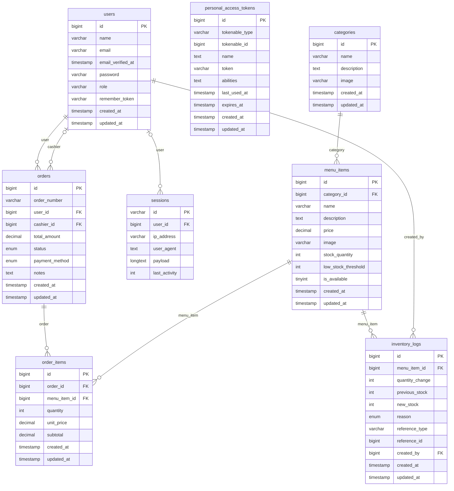

# Singson Canteen — Entity Relationship Diagram

> Auto-generated on 2026-03-15 12:26:05 via `php artisan erd:generate`

## How to View
- **VS Code**: Install *Markdown Preview Mermaid Support* extension, then open this file and press `Ctrl+Shift+V`
- **Online**: Paste the mermaid block into [mermaid.live](https://mermaid.live)
- **GitHub**: Just push this file — GitHub renders Mermaid in Markdown automatically ✅